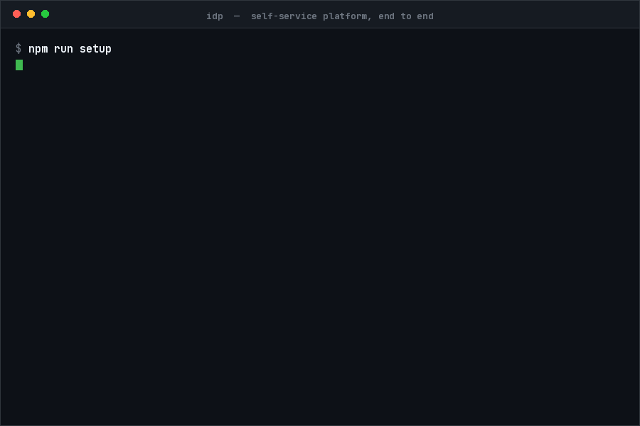
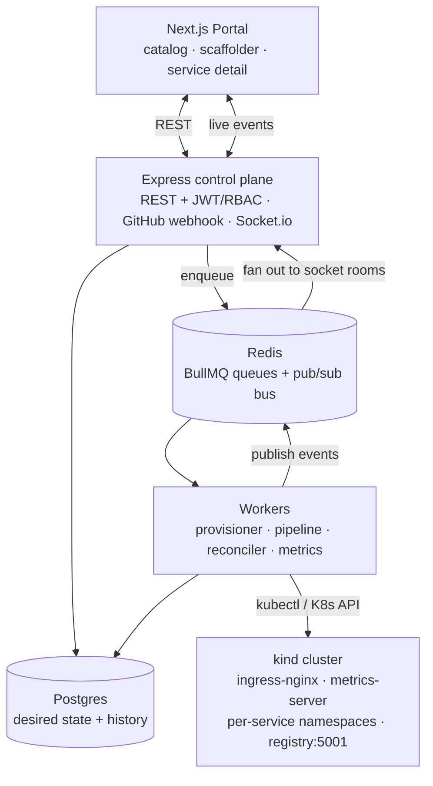

<div align="center">

# IDP — an Internal Developer Platform you can actually read

**A developer types a service name. Sixty seconds later it has a namespace, a quota, a
network policy, a URL, a CI/CD pipeline and dashboards — and it stays that way, because
something is watching.**

<br/>



<br/>

[](https://github.com/Muditalbet/idp/actions/workflows/ci.yml)
[](https://nodejs.org)
[](https://www.typescriptlang.org/)
[](https://kind.sigs.k8s.io/)
[](#license)

</div>

---

## Why this exists

Every company past a certain size builds the same thing: a portal where developers ask for
infrastructure, and a pile of machinery that quietly makes it real. The CNCF answer is
**Backstage + ArgoCD + Crossplane** — three excellent, enormous projects. Wire them together
and you get a platform. You also get a black box: reconciliation happens *somewhere*, drift is
corrected by *something*, and the interesting part — the control loop — is buried under CRDs.

So I rebuilt the interesting part.

This repo is a working IDP in Node and TypeScript where every loop is a file you can open. The
reconciler is 200 lines that diff live cluster state against Postgres and server-side-apply the
difference. The provisioner is a function that turns a claim into five Kubernetes objects. The
pipeline is `clone → build → push → deploy` with its logs streaming to a browser over a socket.
Nothing is hidden, because the point was to understand it, not to abstract it.

It runs entirely on your laptop, on a `kind` cluster, with one command.

| The real thing | What it does | Here |
| --- | --- | --- |
| **Backstage** | Portal, catalog, scaffolder | Next.js app — `apps/portal` |
| **Crossplane** | Declarative claims → real resources | Provisioner worker — `apps/worker` |
| **ArgoCD** | GitOps: desired state → live state | Reconciler worker — `apps/worker` |
| **Tekton / GH Actions** | Build and ship | Pipeline worker — `apps/worker` |
| **Prometheus / Grafana** | Metrics and dashboards | Scraper + portal charts |

---

## The four loops

Everything in the platform is one of four control loops. They're worth reading in this order:

**1. Provision** — `apps/worker/src/processors/provisioner.ts`
A developer's claim ("I want `payments` in `dev`") becomes a Namespace, ResourceQuota,
LimitRange, NetworkPolicy and ServiceAccount. Default-deny networking, sane container limits,
one tenant per namespace. This is the Crossplane idea without the CRD machinery: a claim row in
Postgres, fulfilled by an idempotent apply.

**2. Build & ship** — `apps/worker/src/processors/pipeline.ts`
Clone (or copy the bundled sample), `docker build`, push to a local registry that `containerd`
inside `kind` can actually pull from, then record the desired image and Deployment. Every step
appends to Postgres *and* publishes to Redis, so the portal renders logs live instead of
polling.

**3. Reconcile** — `apps/worker/src/processors/reconciler.ts`
The heart of it. Read the live cluster. Diff against desired state in Postgres. Server-side
apply the difference. Then compute **sync** (`Synced` / `OutOfSync`) and **health**
(`Healthy` / `Progressing` / `Degraded` / `Missing`) the way Argo does. It runs on deploy, on
demand, and every 30 seconds as a drift sweep — which is why `kubectl scale --replicas=5`
quietly undoes itself while you watch.

**4. Observe** — `apps/worker/src/processors/metrics.ts`
Every 15s, scrape each app's `/metrics` through the **Kubernetes pod-proxy API** (no sidecar, no
Prometheus), read CPU and memory from `metrics.k8s.io`, turn counters into rates, store the
samples. The portal charts them and tails pod logs over the same socket.

<details>
<summary><b>How a request actually flows through the system</b></summary>



The API never talks to Kubernetes on the request path. It writes intent to Postgres, enqueues a
job, and returns. Workers do the slow, failure-prone work and narrate it back over Redis. That
separation is the whole reason the portal feels instant while a `docker build` is running.

Full write-up: **[docs/ARCHITECTURE.md](docs/ARCHITECTURE.md)**.
</details>

---

## Run it

You need **Docker Desktop** (running), **Node ≥ 20**, **[kind](https://kind.sigs.k8s.io/docs/user/quick-start/#installation)** and **kubectl**.

```bash
npm install
npm run setup    # kind cluster + ingress-nginx + metrics-server + local registry,
                 # Postgres/Redis via compose, migrate + seed. Idempotent — rerun it freely.
npm run dev      # api :4000 · worker · portal :3000
```

Open **http://localhost:3000**:

| Email | Password | Role |
| --- | --- | --- |
| `dev@idp.local` | `dev123` | developer |
| `admin@idp.local` | `admin123` | platform-admin |

Done playing? `npm run teardown` removes the cluster and containers.

> If `turbo` gets weird in your shell (it sometimes does on Windows), `npm run dev:all` starts the
> same three processes with `concurrently`.

---

## The five-minute tour

This is the demo in the GIF above. It's worth doing yourself — the self-healing bit is more fun
when it's your cluster.

**1 · Scaffold something.** *New Service* → name it `payments`, leave the repo as
`bundled:sample-service`, pick `dev`, create. The Overview tab fills in live as the claim goes
`Pending → Provisioning → Provisioned`.

```bash
kubectl get ns payments-dev
kubectl get resourcequota,networkpolicy -n payments-dev
```

**2 · Ship it.** Hit *Deploy* and open the **Pipelines** tab. `CLONE → BUILD → PUSH → DEPLOY`
streams in as it happens. The service flips to **Synced / Healthy** and the app is live:

```bash
curl http://payments-dev.127.0.0.1.nip.io/
```

**3 · Watch it.** The **Observability** tab has request rate, latency, CPU and memory — plus pod
logs tailing straight from the cluster.

**4 · Break it.** This is the good part:

```bash
kubectl scale deploy/payments --replicas=5 -n payments-dev
```

Within ~30s the service goes **OutOfSync**, the reconciler server-side-applies the desired state,
and it's back to `Synced / Healthy` with one replica. Delete the whole Deployment and it comes
back too.

**5 · Look behind the curtain.** Sign in as `admin@idp.local` for cluster nodes, environment
health rollups, and an audit log of every action the platform took.

Running the test suite needs none of the above — `npm test` exercises the whole API against an
in-memory stand-in for Postgres, Redis and Kubernetes:

```bash
npm test    # 82 API tests + the manifest builders, no cluster required
```

Longer script, including wiring a **real `git push → deploy`** webhook through
[smee](https://smee.io): **[docs/DEMO.md](docs/DEMO.md)**.

---

## What's in the box

```
apps/
  api/       Express control plane — auth, RBAC, claims, webhooks, Socket.io gateway
  worker/    the four loops: provisioner · pipeline · reconciler · metrics
  portal/    Next.js developer portal (App Router, Tailwind, Recharts)
packages/
  shared/    Prisma schema + client, Redis event bus, BullMQ queues, K8s client,
             and the manifest builders
templates/
  node-service/     scaffolder template
examples/
  sample-service/   a small Express app that exposes /metrics and generates its own traffic
scripts/            setup.mjs · teardown.mjs · kind-config.yaml
docs/               ARCHITECTURE.md · DEMO.md
```

**Stack:** Node 22, TypeScript (strict), Express, Prisma + Postgres, BullMQ + Redis, Socket.io,
Zod, JWT; Next.js + Tailwind + Recharts; npm workspaces + Turborepo; kind + ingress-nginx +
metrics-server.

---

## Being honest about it

This is a learning-in-public build, not something to put in front of production traffic. Things I
knowingly left on the floor:

- **Single cluster, local only.** `kind` with host ports 80/443 and `nip.io` hostnames. No
  multi-cluster, no cloud provider, no real DNS.
- **The pipeline shells out to Docker.** Real platforms build in the cluster (Kaniko, BuildKit)
  with proper isolation. This one runs `docker build` on the host and pushes to `localhost:5001`.
- **Secrets are `.env` files.** No Vault, no sealed secrets, no rotation.
- **Two roles.** `developer` and `platform-admin`, scoped by team. Nothing finer-grained.
- **The control loops aren't unit-tested.** The API surface is (82 tests, an in-memory stand-in
  for Postgres/Redis/Kubernetes) and so are the manifest builders, but the provisioner,
  reconciler, pipeline and scraper are verified by running the demo — which is exactly as
  rigorous as it sounds.

If I kept going: policy-as-code on claims (OPA/Kyverno), progressive delivery in the reconciler,
proper build isolation, and cost attribution per namespace.

---

## License

MIT — see [LICENSE](LICENSE). Take any of it.
