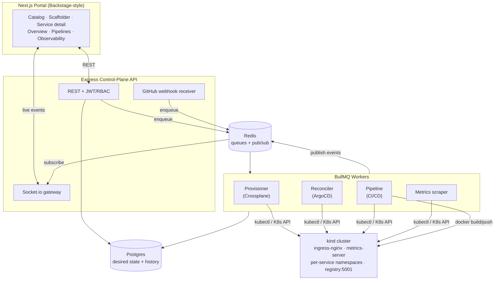

# Architecture

The IDP is a small control plane that turns a developer's intent ("I want a service")
into running, observable infrastructure on Kubernetes — and keeps it that way. It mirrors
the responsibilities of Backstage, ArgoCD and Crossplane, implemented in Node/TypeScript so
every control loop is visible.

## Components

### Control-plane API (`apps/api`)
Express + TypeScript. Owns authentication (JWT, bcrypt), RBAC (`developer` vs
`platform-admin`), the REST surface (services, environments, pipelines, admin), the GitHub
webhook receiver (HMAC-verified), and a Socket.io gateway. The gateway authenticates the
handshake with the same JWT, enforces per-service room access, and bridges the Redis event
bus to browsers. It also tails pod logs on demand.

### Workers (`apps/worker`)
Four BullMQ processors plus two periodic control loops:

- **Provisioner (Crossplane-style).** Fulfils an environment "claim" by applying a Namespace,
  ResourceQuota, LimitRange, NetworkPolicy and ServiceAccount — a sane multi-tenant baseline.
- **Reconciler (ArgoCD-style).** The core GitOps loop. Reads live cluster state, diffs it
  against the desired state in Postgres, **server-side applies** to heal drift, then computes
  **sync** (Synced/OutOfSync) and **health** (Healthy/Progressing/Degraded/Missing). Runs on
  deploy, on demand, and every 30s as a drift sweep — so a manual `kubectl scale` self-heals.
- **Pipeline (CI/CD).** clone/copy → `docker build` → push to the local registry → record the
  desired image + a Deployment → trigger a reconcile. Every step streams logs to Postgres and
  the portal over WebSocket.
- **Metrics scraper.** Every 15s, scrapes each app's `/metrics` through the **Kubernetes
  pod-proxy API**, reads CPU/memory from **metrics.k8s.io**, derives rates from counter deltas,
  and stores time-series samples.

### Data plane
- **Postgres** is the single source of truth: users, teams, services, environments, claims,
  deployments, pipeline runs + logs, metric samples, and an audit log. The reconciler drives
  the cluster toward this declared state.
- **Redis** carries BullMQ job queues and a pub/sub event bus. Workers publish status/log/metric
  events; the API gateway subscribes once and fans out to the right socket rooms.

### Cluster
A local **kind** cluster with ingress-nginx (host ports 80/443), metrics-server, and a local
image registry wired into containerd (`localhost:5001` is pullable in-cluster). Each
environment gets its own namespace; apps are reachable at `<svc>-<env>.127.0.0.1.nip.io`.

## Key design choices

- **Cluster I/O via kubectl + raw API.** Mutations use `kubectl apply --server-side`
  (with `--force-conflicts`, so the platform is the authoritative field manager, exactly like
  ArgoCD). Reads use `kubectl get -o json` and `--raw` for the metrics/pod-proxy APIs. This is
  version-stable and keeps manifests first-class and debuggable.
- **Desired state in Postgres, not Git.** The "GitOps" target is the database; pushes and the
  portal both write desired state, and the reconciler continuously closes the gap.
- **Everything is event-driven.** Provisioning, pipelines, reconciliation and metrics all emit
  events to one Redis channel, giving the portal a single real-time stream.
